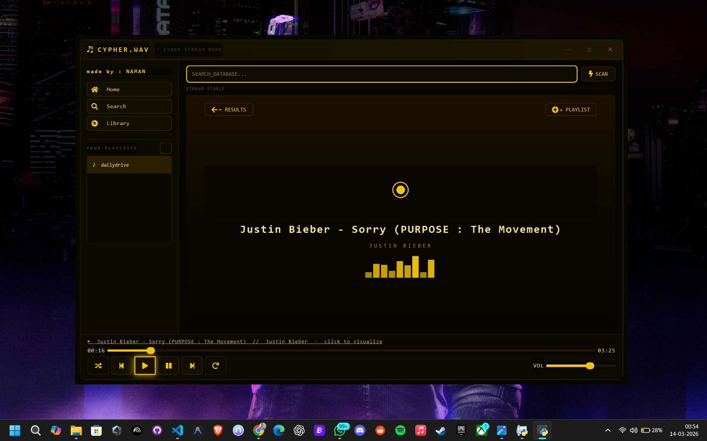
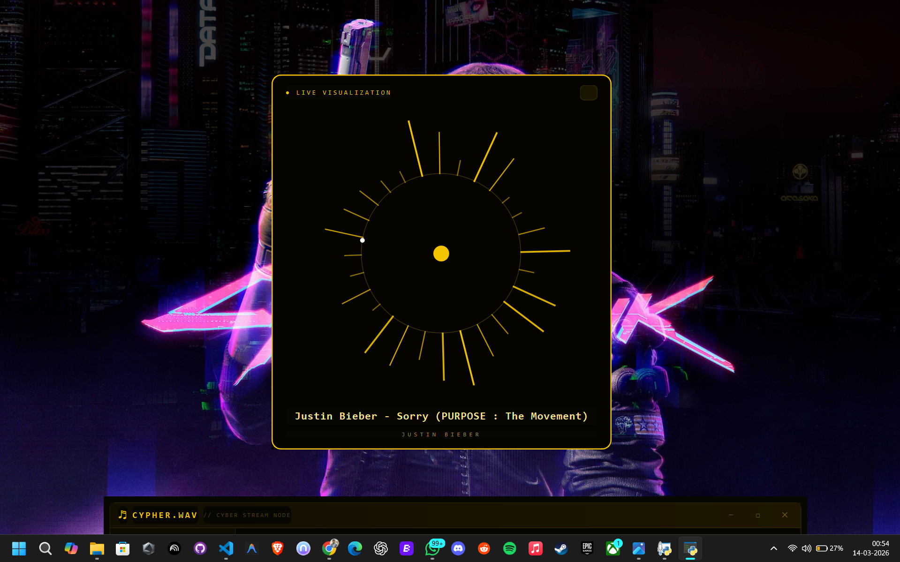

# CYPHER.WAV

> A standalone cyberpunk desktop music streaming application built with Python and PyQt6.
> Search any song, stream it instantly, build playlists, and watch real-time visualizations — no browser required.

---

## Screenshots

<p align="center">
  
</p>

<p align="center">
  
</p>

---

## Features

| Feature | Description |
|---|---|
| Live Search | Search any song via yt-dlp — results appear in ~1-2 seconds |
| Instant Play | Single-click pre-buffers the stream; double-click plays immediately |
| Now Playing Hero | Full-screen track view with animated EQ bars |
| Live Visualizer | Floating circular visualization popup, synced to playback |
| Playlists | Create, manage, and persist multiple playlists locally |
| Playlist Playback | Next / Previous navigate strictly within the active playlist |
| Shuffle | Random track selection within the current context |
| Loop Modes | Off / Loop One / Loop All |
| Recently Played | Home page shows last 10 played tracks |
| Custom Window | Fully frameless window with drag, minimize, maximize |
| Yellow Cyberpunk UI | Dark gold theme built entirely with PyQt6 QSS |

---

## Tech Stack

| Library | Purpose |
|---|---|
| `PyQt6` | Desktop window, layouts, all UI components |
| `PyQt6-Multimedia` (bundled) | Audio streaming via QMediaPlayer + QAudioOutput |
| `yt-dlp` | Headless search engine and direct stream URL extraction |
| `qtawesome` | Font-based vector icons |

---

## Installation

**Requirements:** Python 3.9 or higher

```bash
# 1. Clone the repository
git clone https://github.com/YOUR_USERNAME/CYPHER.WAV.git
cd CYPHER.WAV

# 2. Install dependencies
pip install PyQt6 yt-dlp qtawesome

# 3. Run
python cypher_wav.py
```

---

## How To Use

```
1. Type any song name into the search bar and press Enter or click SCAN
2. Results appear within 1-2 seconds
3. Single-click a result to pre-buffer it
4. Double-click to play
5. Click the now-playing bar at the bottom to open the live visualizer
6. Use + PLAYLIST on the now-playing screen to save the track
7. Access your playlists from the sidebar or the Library page
8. Shuffle and Loop buttons in the player bar control playback order
```

---

## Controls

| Control | Action |
|---|---|
| Double-click track | Play immediately |
| Single-click track | Pre-buffer (makes play faster) |
| Right-click track | Context menu — Play / Add to Playlist |
| Click now-playing bar | Open live visualizer popup |
| Shuffle button | Toggle random order |
| Loop button | Cycle Off / Loop 1 / Loop All |
| Title bar drag | Move window |
| Title bar double-click | Toggle fullscreen |

---

## Project Structure

```
CYPHER.WAV/
├── cypher_wav.py        Main application
├── requirements.txt     Python dependencies
├── playlists.json       Auto-generated playlist storage
└── assets/
    ├── one.png          Screenshot — search view
    └── two.png          Screenshot — now playing view
```

---

## Architecture Notes

- **Two-phase search** — Phase 1 fetches metadata only (fast). Phase 2 resolves the direct audio URL only when a track is selected, keeping search response near-instant.
- **Threading** — All network operations run in QThread workers so the UI never freezes.
- **Format preference** — yt-dlp is configured to prefer `m4a / AAC` which Windows Media Foundation decodes natively, avoiding codec errors.
- **Playlist isolation** — A `_playing_from` context flag ensures next/prev navigation stays strictly within the source that started playback (playlist or search results).

---

## Made by

**NAMAN** — built as part of the AITD project series.

---

## License

This project is for personal and educational use.
Audio content is sourced in real-time and is subject to the terms of the originating platforms.
